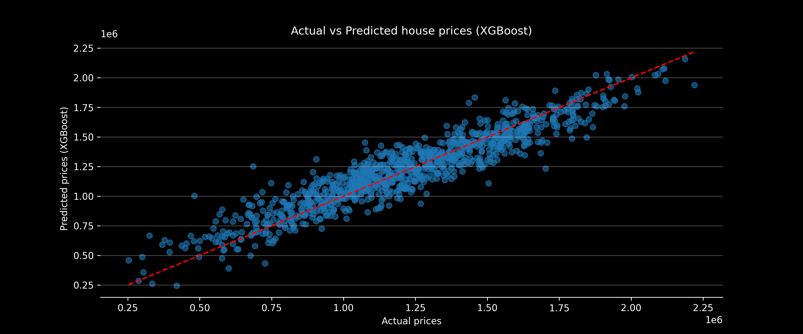

# USA House Price Prediction
`ML, Data Science, Regression, Python`
This project aims to predict house prices in the USA using various machine learning models. The dataset includes features such as the number of bedrooms, bathrooms, square footage, location, and other relevant attributes. The goal is to build a robust model that can accurately estimate house prices based on these features.


## Structure of the Project
```.
|-- Readme.md
|-- eval
|   |-- actual_vs_predicted_xgb.png
|   |-- eval.csv
|   |-- labels.csv
|   |-- predictions_distribution.png
|   |-- submission.csv
|-- house_data.csv
|-- models
|   |-- transforms
|       |-- processor.pkl
|-- notebook.ipynb
|-- requirements.txt
|-- train_eval.py
```

## Data
The dataset used in this project is sourced from [GitHub](https://github.com/miirshe/USA-Housing-Analysis-and-Prediction-Price/tree/main). It contains various features related to house properties in USA and their corresponding sale prices:

- `avg_income`: The average income of the area where the house is located.
- `house_age`: The age of the house in years.
- `nof_rooms`: The number of rooms in the house.
- `nof_bedrooms`: The number of bedrooms in the house.
- `population`: The population of the area.
- `address`: The address of the house.
- `price`: The sale price of the house (target variable).

## Methodology
The project follows a structured approach to data preprocessing, model training, and evaluation.

1. **Data Exploration**: Initial exploration of the dataset to understand the features and their distributions.
2. **Data Preprocessing**: Handling missing values, encoding categorical variables, and scaling numerical
    features. Special attention is given to the `address` column, which is preprocessed to extract meaningful information.
3. **Model Selection**: Several regression models are tested, including:
    - Linear Regression
    - Bayesian Ridge Regression
    - Random Forest Regressor
    - Gradient Boosting Regressor
    - K-Nearest Neighbors Regressor
    - XGBoost Regressor
4. **Feature Selection**: Using techniques like Lasso and Random Forest feature importance to select the most relevant features for each model.
5. **Hyperparameter Tuning**: Using techniques like Randomized Search Cross-Validation to find the best hyperparameters for each model.
6. **Model Evaluation**: Evaluating model performance using metrics such as Mean Squared Error (MSE) and R-squared ($R^2$).
7. **Final Predictions**: Generating predictions on the evaluation dataset and preparing a submission file.

## Results
The XGBoost model achieved the best performance with an $R^2$ of 0.872 on the validation set, followed closely by Bayesian Ridge and Linear Regression models. The K-Nearest Neighbors model had the lowest performance among the tested models.

| Models on val       | Test MSE    | Test R2 | Rank |
|---------------------|------------|---------|------|
| **GBoost**          | **1.545e10**   | **0.8794**  | **1**  |
| Bayesian Ridge      | 1.663e10   | 0.8701  | 2    |
| Linear Regression   | 1.664e10   | 0.8701  | 3    |
| Random Forest       | 1.856e10   | 0.8550  | 4    |
| K-Nearest Neighbors | 1.861e10   | 0.8546  | 5    |



The results improved a lot after cleaning the data more carefully and making use of the **address information**, which turned out to be very valuable. The best model was **XGBoost**, while simpler ones like KNN worked less well. This shows that **good data preparation is just as important as the choice of model**, and future improvements could make predictions even more accurate.


## How to Run the Project?
To run this project, make sure you have **Python** (>=3.11.9) installed on your system. Once ready, follow these steps:

1. **Clone the repository**

   ```bash
   git cclone https://github.com/aurvl/Housing-Price-Prediction.git
   cd Housing-Price-Prediction
   ```

2. **Install the dependencies**

   ```bash
   pip install -r requirements.txt
   ```

3. **Run the project**

   * Step 1: Run the training and evaluation script (**without polynomial features and features selection**) directly:

     ```bash
     python train_eval.py
     ```

   * Step 2: Open the Jupyter notebook and execute the cells sequentially

### **Note**
- *The project was developed and tested using Python 3.11.9 on Windows 11 with Jupyter Notebook and VSCode. Results may vary slightly with different Python versions or operating systems.*
- *To ensure reproducibility, random seeds were set for NumPy, scikit-learn, and XGBoost. However, due to the nature of some algorithms, results may still show minor variations between runs.*
- *The preprocessing pipeline is effective but not yet fully optimized. Further improvements in feature engineering, especially around the `address` column, could enhance results.*
- ***To go further:***
    * *Experiment with more advanced models like LightGBM or CatBoost.*
    * *Experiment other feature selection technics can slightly improve the models*
    * *Explore deep learning approaches using frameworks like TensorFlow or PyTorch.*
    * *Incorporate external data sources for richer feature sets, such as geographic or economic indicators.*
> Dataset provided by [USA Housing Dataset on GitHub](https://github.com/miirshe/USA-Housing-Analysis-and-Prediction-Price/tree/main).